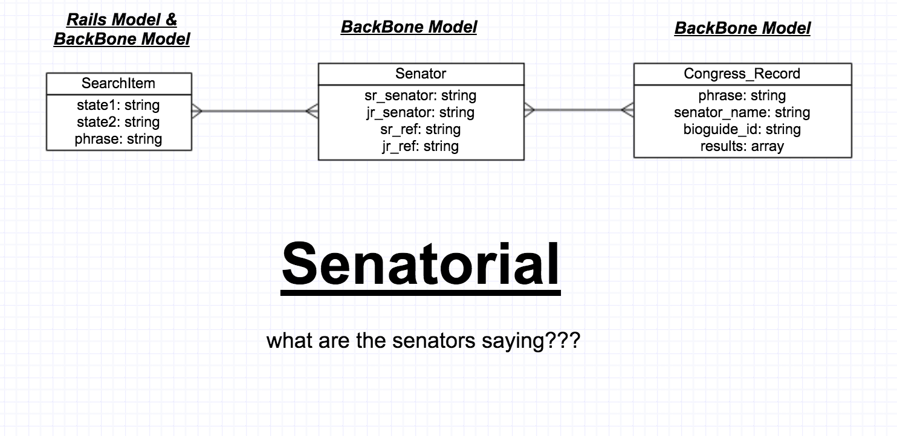

#Senatorial

###Overview

**Senatorial** tells you what senators are talking about on the floor of the senate or in a committee meeting.  

The User puts in a couple of states, like CA and NV and a phrase like health. First it finds the four senators for those two states from one API. Then it uses another API to return the number of Congressional Records over the last few months that contain that phrase. All displayed in a line chart using D3 and C3!

This is a single page app that has a Rails backend on the first model and is using Backbone with all three Models.

[Visit Senatorial] (https://secure-plains-1434.herokuapp.com/)

Senatorial uses two external APIs:
GovTrak.us: https://www.govtrack.us/developers/api
Capitol Words: http://tryit.sunlightfoundation.com/capitolwords

Based on two states and phrase query selections by the user, data is pulled from the GobTrak API and subsequently passed to the Capital Words API.

###Backlog: 
For list of user stories and backlog, see the public Pivitol Tracker: https://www.pivotaltracker.com/s/projects/1195932.

###Technology used:
- Ruby on Rails
- Backbone.js
- D3.js
- C3.js

###ERD:

### Local Setup

    rake db:create
    bundle install
    rake db:migrate
    rake db:seed
    rails s

    Open the page locally on http://localhost:3000.
    Note that you will need to request access token for the Congress Words API and replace it as appropriate within the code. 
    
=
######Written by Martin Johnson
